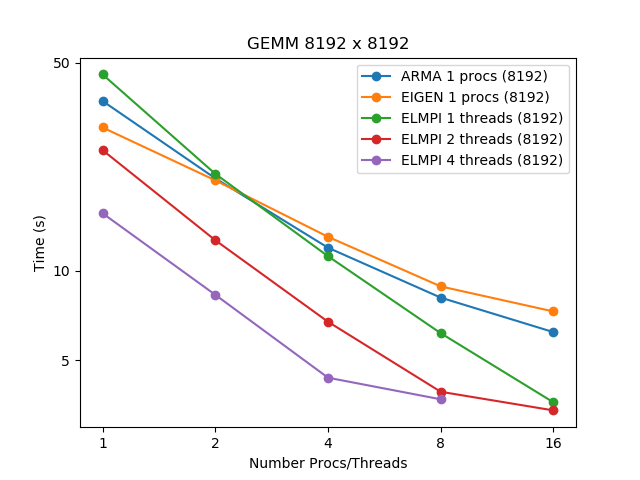

# gBenchLinAlg

##Installation 

Install googlebenchmark : https://github.com/google/benchmark the cmake should do the rest.

```
git clone https://github.com/NLESC-JCER/gBenchLinAlg
cd gBenchLinALg
mkdir build
cd build
cmake ..
make
```

## Use

Several example of scripts are in `jobs/`. You can control the number of process and the number of threads for each with the usual environment variables. The size of the matrices tested are specified directly in the C++ files (maybe we can change that). A python script is there to plot the result (experimental)

